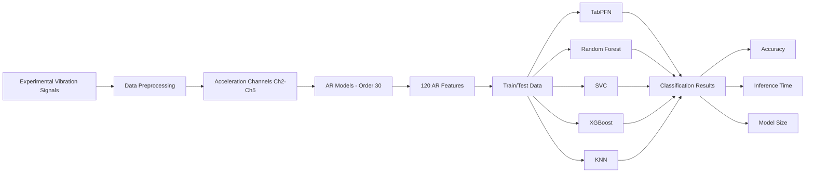

# 🏗️ Tabular Prior-Data Fitted Network for Structural Damage Prediction

Machine Learning-based Structural Health Monitoring (SHM) using **TabPFN** and vibration-based features extracted from autoregressive (AR) models.

This repository contains the source code associated with the paper **"Tabular Prior-Data Fitted Network for Structural Damage Prediction"**, presented at the **28th ABCM International Congress of Mechanical Engineering (COBEM 2025)**.

---

## 📖 Overview

This project investigates the application of **Tabular Prior-Data Fitted Network (TabPFN)** for structural damage prediction using vibration measurements obtained from an experimental multi-story mechanical structure.

The proposed approach combines:

1. **Vibration-based Structural Health Monitoring (SHM):** Experimental vibration signals collected from a three-story structure under multiple structural conditions.
2. **Autoregressive (AR) Feature Extraction:** AR models of order 30 are fitted to acceleration signals to obtain damage-sensitive features.
3. **TabPFN Classification:** A pre-trained Transformer designed for small tabular datasets is used to classify the structural states without dataset-specific hyperparameter tuning.
4. **Baseline Comparison:** TabPFN is evaluated against Random Forest, Support Vector Classifier (SVC), XGBoost, and K-Nearest Neighbors (KNN).
5. **Computational Evaluation:** Predictive accuracy, inference time, and model size are analyzed to assess the applicability of the models to Structural Health Monitoring systems.

The complete experimental methodology and results are described in the associated paper. The source code is provided in this repository.

---

## 🏗️ Methodology

The overall workflow of the study can be summarized as:



### Experimental Pipeline

The vibration signals are processed using the following pipeline:

```text
Vibration Signals
       │
       ▼
Acceleration Channels
Ch2 ─ Ch3 ─ Ch4 ─ Ch5
       │
       ▼
AR Model (p = 30)
       │
       ▼
AR Coefficients
30 features/channel
       │
       ▼
120-dimensional feature vector
       │
       ▼
Classification
       │
       ├── TabPFN
       ├── Random Forest
       ├── SVC
       ├── XGBoost
       └── KNN
       │
       ▼
Performance Evaluation
```

---

## 🔬 Experimental Dataset

The experimental setup consists of a **three-story mechanical structure** made of aluminum plates and columns with bolted joints. The structure is mounted on rails for unidirectional movement.

Damage and nonlinear behavior are simulated through an additional central column on the upper story interacting with an adjustable stopper.

The study considers **17 distinct structural states**, including undamaged and damaged conditions.

### Structural States

| Category  | States | Description                                                   |
| --------- | -----: | ------------------------------------------------------------- |
| Undamaged |    1–9 | Baseline conditions, mass additions, and stiffness reductions |
| Damaged   |  10–17 | Different gap sizes and combinations with added mass          |

The damaged configurations include gaps of:

* 0.20 mm
* 0.15 mm
* 0.13 mm
* 0.10 mm
* 0.05 mm

Each structural state was excited **10 times**, resulting in 170 experimental cases.

Five acquisition channels were considered:

| Channel | Sensor        | Location                 |
| ------- | ------------- | ------------------------ |
| Ch1     | Load cell     | Base / shaker excitation |
| Ch2     | Accelerometer | Base                     |
| Ch3     | Accelerometer | 1st floor                |
| Ch4     | Accelerometer | 2nd floor                |
| Ch5     | Accelerometer | 3rd floor                |

For each test:

* **8192 samples** per channel
* Sampling time: **3.125 × 10⁻³ s**
* Sampling frequency: **320 Hz**
* Signal duration: **25.6 s**

The experimental dataset is therefore represented as a three-dimensional array containing the temporal samples, acquisition channels, and experimental tests.

---

## 🧮 Feature Extraction

Autoregressive models are used to transform the vibration signals into a compact tabular representation.

For each acceleration channel (**Ch2–Ch5**), an **AR model of order 30** is fitted independently to each experimental case.

This produces:

```text
4 acceleration channels
        ×
30 AR coefficients
        =
120 features
```

The resulting feature representation is therefore:

```text
170 experimental cases × 120 features
```

These AR coefficients are used as the primary input features for the machine learning classifiers.

The AR representation captures changes in the dynamic behavior of the structure associated with different structural conditions. The study reports observable differences between damaged and undamaged states in the AR coefficient patterns, including reductions in amplitude in specific coefficient ranges.

---

## 🤖 TabPFN

**Tabular Prior-Data Fitted Network (TabPFN)** is a pre-trained Transformer architecture designed for classification problems involving small tabular datasets.

Instead of performing conventional dataset-specific hyperparameter optimization, TabPFN uses a pre-trained model and **in-context learning** to perform classification.

In this study, TabPFN is applied directly to the AR-derived tabular features.

## A multi-class extension was required because the experimental problem contains **17 structural states**, exceeding the standard class-handling capacity considered in the experimental configuration. The implementation used `tabpfn_extensions.many_class`.

## ✨ Features

* 🏗️ **Structural Health Monitoring:** Vibration-based structural state classification.
* 📈 **AR Feature Extraction:** Damage-sensitive features obtained using autoregressive models.
* 🤖 **TabPFN Classification:** Pre-trained Transformer for tabular classification.
* ⚙️ **No Hyperparameter Tuning:** TabPFN is evaluated without dataset-specific hyperparameter optimization.
* 🔬 **17 Structural States:** Classification of multiple experimental structural conditions.
* 🌲 **Random Forest Baseline:** Ensemble-tree comparison model.
* 🎯 **SVC Baseline:** Support Vector Classifier comparison.
* 🚀 **XGBoost Baseline:** Gradient-boosting comparison model.
* 📍 **KNN Baseline:** Instance-based classification comparison.
* ⏱️ **Inference Benchmarking:** Evaluation of prediction latency.
* 💾 **Model Footprint:** Comparison of model memory size.
* 📊 **Confusion Matrices:** Per-class analysis of classification behavior.

---

## 🛠️ Installation & Setup

### 1. Prerequisites

The source code is provided as a Jupyter Notebook:

```text
Source_Code_COBEM_2025.ipynb
```

A Python environment capable of running Jupyter Notebook/Lab is required.

The notebook uses the machine learning methodology described in the paper, including TabPFN and the baseline classifiers.

### 2. Clone the Repository

```bash
git clone https://github.com/iago-rhuda/Tabular_Prior_Data_Fitted_Network_For_Structural_Damage_Prediction.git

cd Tabular_Prior_Data_Fitted_Network_For_Structural_Damage_Prediction
```

### 3. Create a Virtual Environment

```bash
python -m venv .venv
```

Activate the environment.

#### Linux / macOS

```bash
source .venv/bin/activate
```

#### Windows

```powershell
.venv\Scripts\activate
```

### 4. Install Dependencies

Install the packages required by the notebook:

```bash
pip install jupyter numpy pandas scipy scikit-learn matplotlib seaborn xgboost tabpfn
```

If the multi-class TabPFN extension is required by the notebook:

```bash
pip install tabpfn-extensions
```

> **Note:** The exact dependency versions should preferably be taken from the execution environment used to generate the results reported in the paper.

### 5. Start Jupyter

```bash
jupyter notebook
```

Open:

```text
Source_Code_COBEM_2025.ipynb
```

and execute the notebook cells sequentially.

---

## 💻 Usage Guide

### 1. Load the Experimental Data

The notebook starts from the vibration measurements obtained from the experimental structural setup.

The data contains measurements from:

```text
Ch1 → Excitation force
Ch2 → Base acceleration
Ch3 → 1st-floor acceleration
Ch4 → 2nd-floor acceleration
Ch5 → 3rd-floor acceleration
```

### 2. Extract AR Features

The acceleration channels are processed independently using AR models with:

```text
AR order = 30
```

The coefficients from Ch2–Ch5 are concatenated into a 120-dimensional feature vector.

```text
Ch2: 30 coefficients
Ch3: 30 coefficients
Ch4: 30 coefficients
Ch5: 30 coefficients
----------------------
Total: 120 features
```

### 3. Train/Test Classification

The resulting tabular representation is used to evaluate:

```text
TabPFN
Random Forest
SVC
XGBoost
KNN
```

### 4. Evaluate the Models

The models are evaluated according to:

* Classification accuracy
* Average inference time
* Median inference time
* Inference-time standard deviation
* Total inference time
* Model size
* Confusion matrices

---

## 📊 Results

The experimental results reported in the paper are summarized below.

### Classification Accuracy

| Model         |   Accuracy |
| ------------- | ---------: |
| **TabPFN**    | **99.18%** |
| Random Forest |     98.67% |
| SVC           |     98.93% |
| KNN           |     97.90% |
| XGBoost       |     96.16% |

TabPFN achieved an accuracy of **99.18%** without dataset-specific hyperparameter tuning.

### Inference Time

| Model         | Average Inference Time |
| ------------- | ---------------------: |
| TabPFN        |             53.3062 ms |
| Random Forest |              0.0301 ms |
| SVC           |              0.0169 ms |
| XGBoost       |              0.0182 ms |
| KNN           |              0.0192 ms |

The reported total inference time for TabPFN was **339.8273 s**, compared with less than one second for the evaluated traditional classifiers.

### Model Size

| Model         |    Average Size |
| ------------- | --------------: |
| TabPFN        |   465,674 bytes |
| Random Forest | 1,024,082 bytes |
| SVC           |   187,947 bytes |
| XGBoost       | 1,613,991 bytes |
| KNN           |   415,319 bytes |

TabPFN therefore presented a moderate model footprint relative to the evaluated models.

### Summary

The experiment demonstrates a clear computational trade-off:

```text
                    Accuracy        Inference Time
                       ▲                   │
                       │                   │
                  TabPFN                 │
                       │                   │
                       │                   ▼
                       │             Traditional
                       │               Models
                       └─────────────────────────►
                              Speed
```

TabPFN obtained the highest classification accuracy in the reported experiment, while requiring substantially more inference time than the baseline classifiers. The paper attributes the increased latency partly to the complexity of the problem, including **17 classes**, **120 features**, hardware limitations, and the multi-class extension used in the experiment.

---

## 🔎 Confusion Matrix Analysis

The confusion matrices provide a more detailed view of the classification behavior across the 17 structural states.

The reported results indicate that:

* TabPFN presented very few classification errors, mainly involving states **12–14**.
* SVC occasionally confused states **13 and 14**.
* KNN showed confusion between states **11 and 12**.
* Random Forest presented scattered errors primarily among states **10–14**.
* XGBoost showed more systematic confusion among states **11–14**, contributing to its lower overall accuracy.

These results highlight that overall accuracy alone does not fully describe the classification behavior of the models across individual structural states.

---

## 📁 Repository Structure

The repository currently contains the following main files:

```text
.
├── LICENSE
├── README.md
└── Source_Code_COBEM_2025.ipynb
```

The Jupyter Notebook contains the source code associated with the COBEM 2025 study.

---

## 📚 Paper

**Tabular Prior-Data Fitted Network for Structural Damage Prediction**

**Authors:**

* Iago Rhudá Ramos
* Ricardo Augusto Baena da Costa
* Edo Walfrido de Almeida
* Helon Vicente Hultmann Ayala

**Institution:**

Pontifícia Universidade Católica do Paraná (PUCPR)

**Event:**

28th ABCM International Congress of Mechanical Engineering (COBEM 2025)

**Location:**

Curitiba, Paraná, Brazil

**Dates:**

November 9–14, 2025

## The paper describes the experimental methodology, feature extraction process, TabPFN implementation, baseline comparisons, and computational results presented in this repository.

## 📖 References

1. Contente, C. O., & Ayala, H. V. H. (2021). *Establishing compromise between model accuracy and hardware use for distributed structural health monitoring*. Proceedings of the XV Simpósio Brasileiro de Automação Inteligente (SBAI 2021), 1512–1519.

2. Figueiredo, E., Figueiras, J., Park, G., Farrar, C. R., & Worden, K. (2011). *Influence of the Autoregressive Model Order on Damage Detection*. Computer-Aided Civil and Infrastructure Engineering, 26, 225–238.

3. Figueiredo, E., Park, G., Figueiras, J., Farrar, C., & Worden, K. (2009). *Structural Health Monitoring Algorithm Comparisons Using Standard Data Sets*. Los Alamos National Laboratory Report LA-14393.

4. Hollmann, N., Müller, S., Eggensperger, K., & Hutter, F. (2023). *TabPFN: A Transformer That Solves Small Tabular Classification Problems in a Second*. International Conference on Learning Representations (ICLR 2023).

5. Hollmann, N., Müller, S., Purucker, L., Krishnakumar, A., Körfer, M., Hoo, S. B., Schirrmeister, R. T., & Hutter, F. (2025). *Accurate predictions on small data with a tabular foundation model*. Nature, 637, 319–326.

6. Karmaker Santu, S. K., Hassan, M. M., Smith, M. J., Xu, L., Zhai, C., & Veeramachaneni, K. (2022). *AutoML to date and beyond: Challenges and opportunities*. ACM Computing Surveys, 54(8), 175:1–175:36.

7. Lara-Abelenda, F. J., et al. (2025). *Transfer learning for a tabular-to-image approach: A case study for cardiovascular disease prediction*. Journal of Biomedical Informatics, 165, 104821.

8. Regan, T., Beale, C., & Inalpolat, M. (2017). *Wind Turbine Blade Damage Detection Using Supervised Machine Learning Algorithms*. Journal of Vibration and Acoustics, 139(6), 061010.

9. Zonzini, F., et al. (2020). *Structural Health Monitoring and Prognostic of Industrial Plants and Civil Structures: A Sensor to Cloud Architecture*. IEEE Instrumentation & Measurement Magazine, 23(6), 21–27.

---

## 📜 License

This project is distributed under the **MIT License**.

See [`LICENSE`](LICENSE) for details.

---

## 👤 Authors

Developed by:

**Iago Rhudá Ramos**
**Ricardo Augusto Baena da Costa**
**Edo Walfrido de Almeida**
**Helon Vicente Hultmann Ayala**

Pontifícia Universidade Católica do Paraná (PUCPR)

---

## 🔗 Repository

Source code:

https://github.com/iago-rhuda/Tabular_Prior_Data_Fitted_Network_For_Structural_Damage_Prediction

---

## 🚀 Future Work

The paper identifies several directions for future development:

* Hardware acceleration for TabPFN inference.
* More efficient TabPFN implementations.
* Model compression techniques.
* Improved deployment on edge-computing platforms.
* Further investigation of inference-time efficiency for real-time SHM.
* Evaluation of scalability under different structural monitoring configurations.

These directions aim to reduce the computational limitations observed in the current experimental configuration while preserving the predictive performance of TabPFN.
